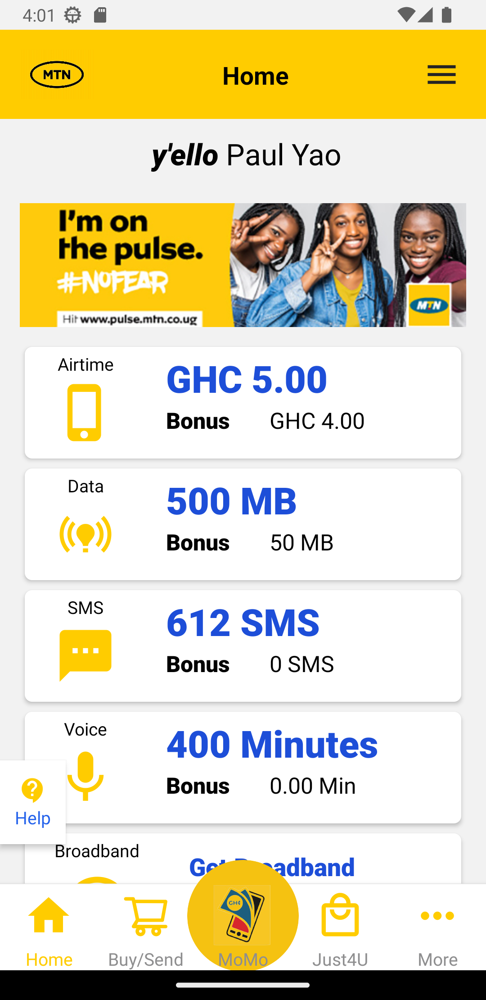
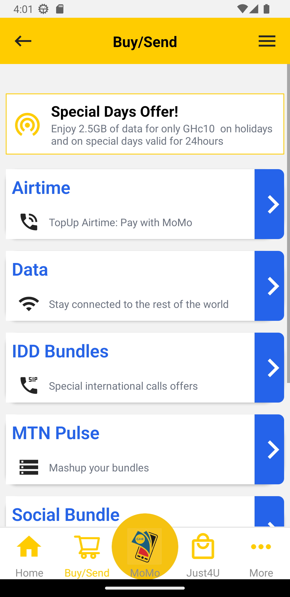
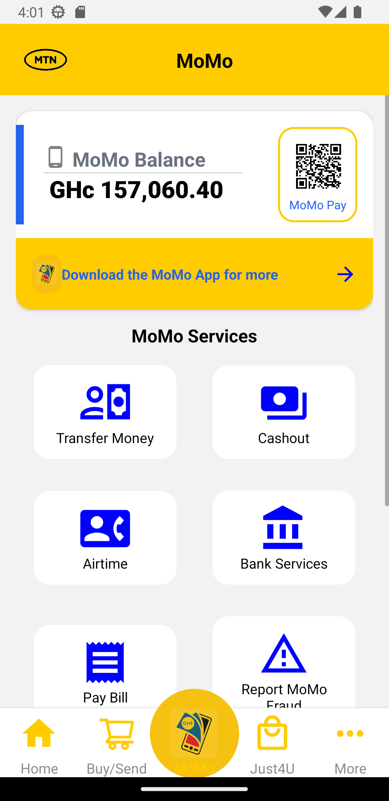

## Installation

First, clone the repository:

git clone https://github.com/0xNunana/MyMTN-app.git

Then, install the dependencies:
cd your repository
npm install

To start the Expo server, run:
expo start

## Images

